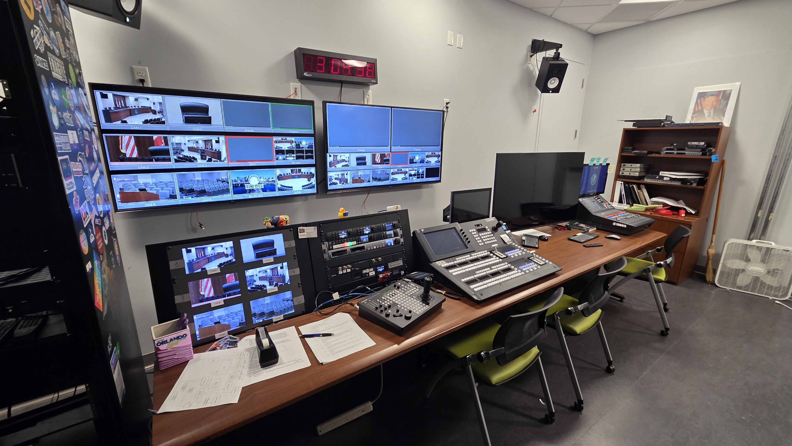
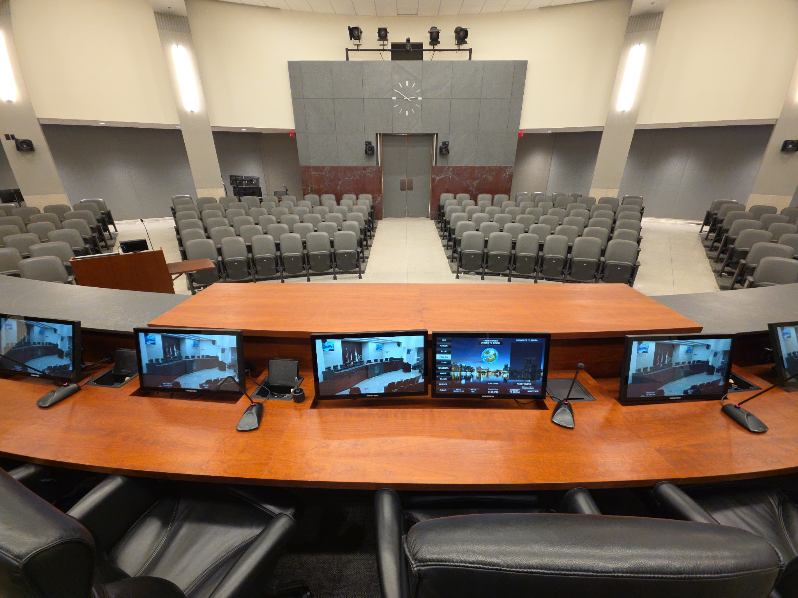
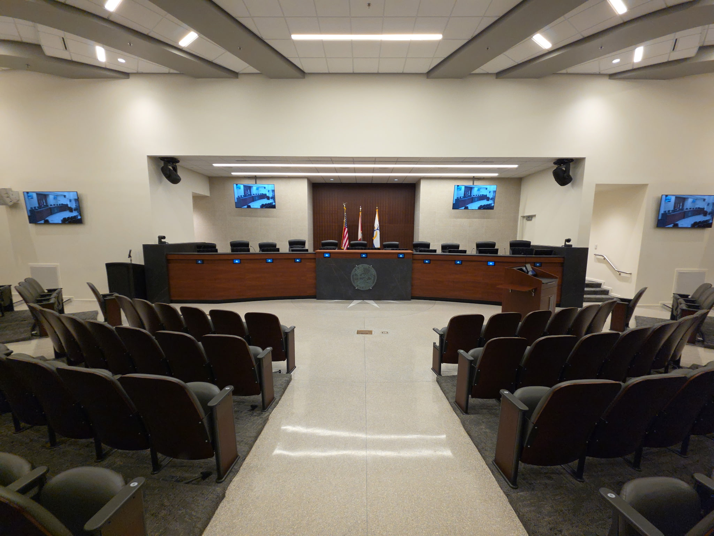
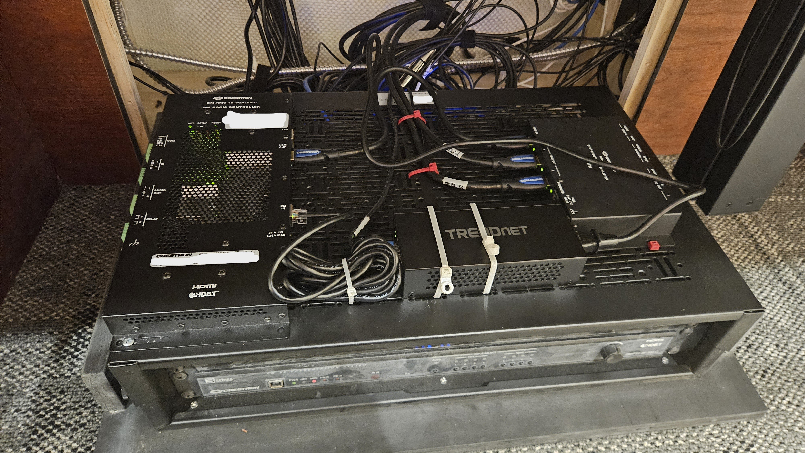

# Broadcast Production Environment

## Project Overview

Maintained and supported a professional municipal broadcast production
environment used for live government meetings, public events, and
streaming operations.

The environment included production computers, video monitoring,
recording and streaming systems, SDI and HDMI signal paths, video
conversion and distribution equipment, and Crestron-based AV and
control infrastructure.

My role focused on maintaining the environment, diagnosing failures,
replacing and configuring failed equipment, improving reliability, and
escalating specialized repairs when appropriate.

## Production Environment

The broadcast environment combined production switching, multiview
monitoring, recording, streaming, computer systems, audio, video
routing and conversion, and associated equipment used to support live
municipal broadcasts.

## Council Chambers

The broadcast control environment supported the audiovisual and
production systems installed throughout the council chambers.

My responsibilities extended beyond the control room to troubleshooting
and maintaining chamber technology, including displays, signal paths,
Crestron hardware, video distribution, and related production systems.

When failures occurred, I isolated problems to the affected component
or signal path, replaced and configured hardware when appropriate, and
coordinated with outside integrators when specialized replacement or
service was required.

*Integrated displays, monitoring, microphones, and audiovisual systems
at the council dais.*

*Council chambers supported by the broadcast and audiovisual production
environment.*

## System Review and Acceptance

Although I was not the system designer or the person with formal
sign-off authority, I participated extensively in reviewing the
production system during its design and installation.

I evaluated the proposed system from an operational and technical
perspective and checked the completed installation against our
requirements and specifications.

The person responsible for formal acceptance relied on my technical
assessment before approving the completed system.

## Systems Supported

My support responsibilities included equipment and workflows involving:

- Production and streaming computers
- Video monitors and displays
- Standalone video recorders
- Streaming encoders
- SDI and HDMI signal paths
- Video standards converters
- Video distribution and splitting equipment
- Crestron AV and control hardware
- Production peripherals and associated connectivity

Support ranged from routine configuration and equipment replacement to
isolating failures across interconnected systems.

## Hardware Replacement and Configuration

When equipment failed, I diagnosed the problem and determined whether
it could be resolved internally or required outside support.

When replacement equipment or spare components were available, I
replaced failed hardware and configured the replacement for the
existing production workflow.

Over the life of the system, this included replacing and configuring
multiple standalone video recorders as hardware failed, as well as
monitors, converters, distribution equipment, streaming hardware,
computers, and other production components.

The objective was not simply to replace a failed device, but to restore
its function within the larger production system and verify that the
complete workflow operated correctly.

## Streaming Infrastructure

The department originally relied on an outside company to handle
livestreaming.

When streaming was brought in house, I specified and configured a
computer-based streaming system using Wirecast.

I later transitioned the streaming workflow to dedicated Blackmagic
encoding hardware after determining that the dedicated encoders
provided a more stable solution for our operational needs.

This work included supporting the streaming computers and encoders,
configuring replacement equipment, and troubleshooting the signal and
streaming workflow.

## Crestron and Integrated-System Troubleshooting

The production and meeting environments included Crestron hardware
integrated into larger AV and control systems.

I troubleshot these systems to isolate failures to the component level
when possible.

If the required repair could be completed with available replacement
hardware, I performed the replacement and verified operation. When a
problem required specialized parts or outside service, I contacted the
appropriate vendor after narrowing the issue to the affected component.

Providing the vendor with an already-isolated problem reduced the time
required for outside troubleshooting and helped move the repair directly
toward the required component or service.

## Support Example: Council Chamber Display Failure

A few hours before a City Council meeting, the Mayor's integrated
monitor stopped working.

I traced the video path through the chamber system and isolated the
failure to a Crestron scaler installed inside the dais. The scaler's
external power supply had failed, and an immediate replacement power
supply was not available.

The scaler also supported Power over Ethernet. I located an available
PoE injector and used it to provide an alternate supported power source
to the scaler.

After restoring power, I verified that the scaler and monitor were
operating correctly, secured the equipment and access panel, and
returned the system to service before the meeting.

This avoided leaving a critical meeting position without its display
while allowing the failed power-supply issue to be addressed separately.

### Hardware Involved

The following photograph shows Crestron hardware and the PoE equipment
used while supporting the integrated AV environment.

## Troubleshooting Approach

Supporting the environment required troubleshooting complete systems
rather than individual devices in isolation.

Depending on the failure, diagnosis could involve:

- Source equipment
- Computers and software
- SDI or HDMI signal paths
- Cabling and physical connections
- Video conversion or distribution
- Recording and streaming equipment
- Displays and monitoring
- Device power
- Network connectivity
- Integrated Crestron hardware

I worked through the signal or control path to isolate the failed layer
or component, replaced or reconfigured equipment when appropriate,
verified restored operation, and escalated specialized work when the
repair exceeded available parts or internal support capabilities.

## Skills Demonstrated

- Production-system technical support
- Hardware troubleshooting and replacement
- PC configuration and support
- Streaming-system configuration
- Hardware encoder deployment
- SDI and HDMI troubleshooting
- Video conversion and distribution
- Crestron AV troubleshooting
- Power and connectivity troubleshooting
- PoE troubleshooting and application
- Component-level fault isolation
- Replacement hardware configuration
- System testing and verification
- Vendor coordination and escalation
- Technical evaluation and system acceptance support
- Operational support for live environments

## Project Context

This environment was part of my professional municipal broadcast work.

I did not design or build the original production system. My role
included technical review during its implementation and ongoing
responsibility for maintaining, troubleshooting, repairing,
reconfiguring, and supporting the environment throughout its
operational life.
