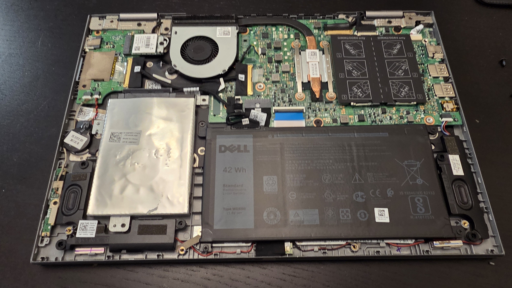
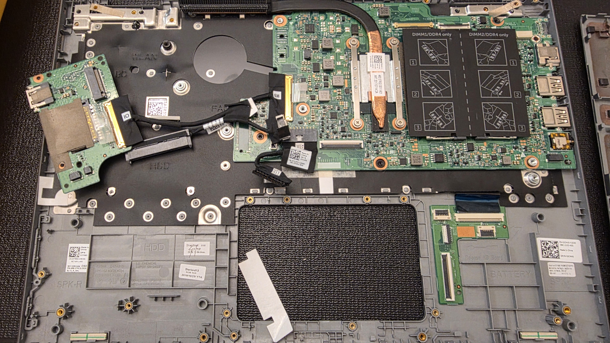
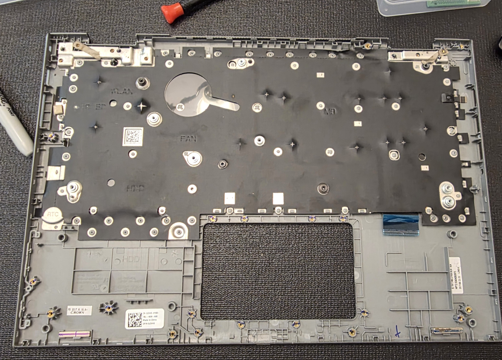
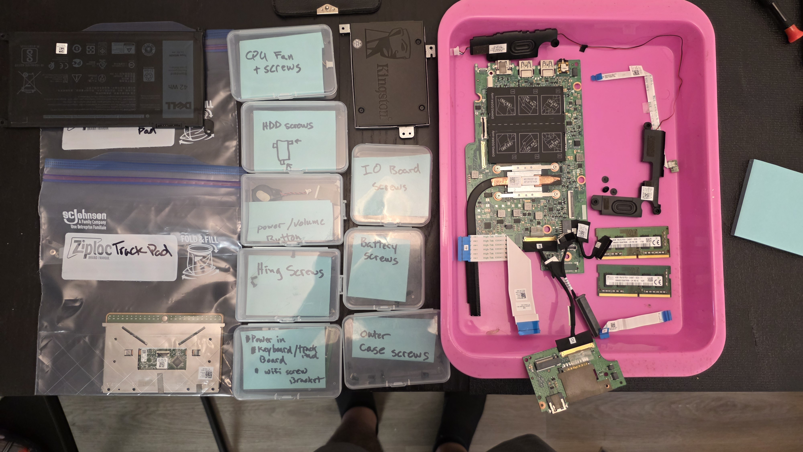
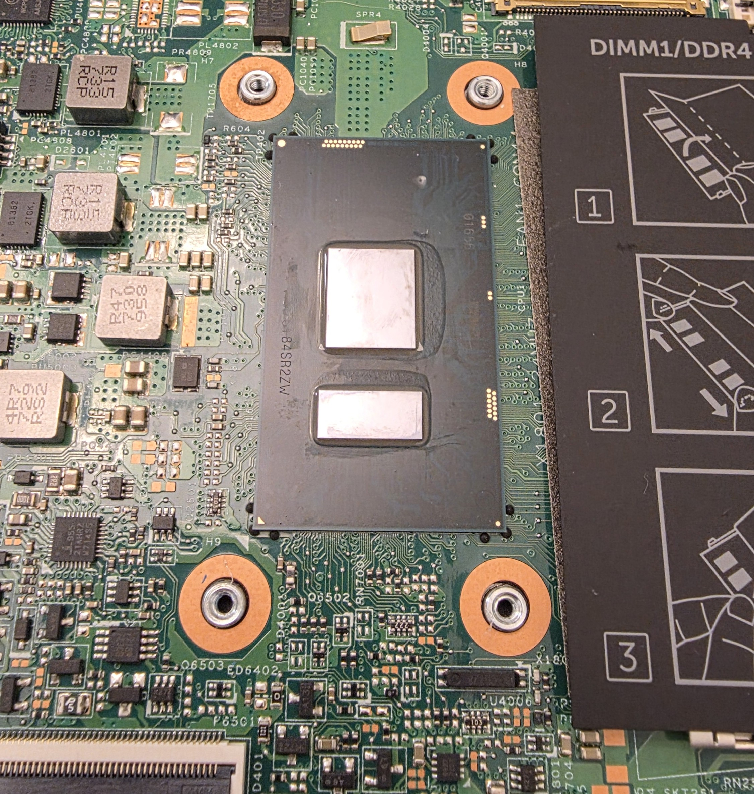
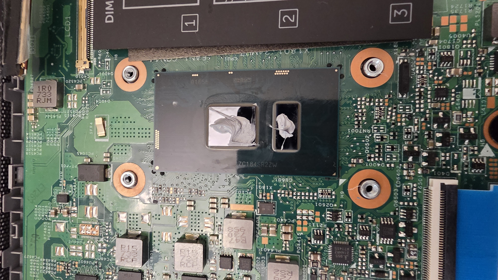
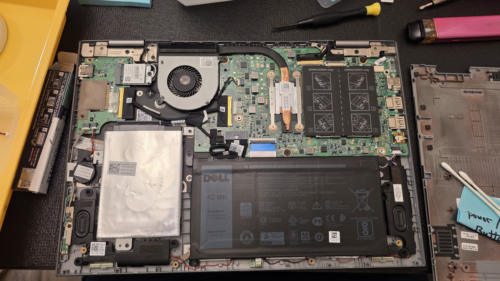
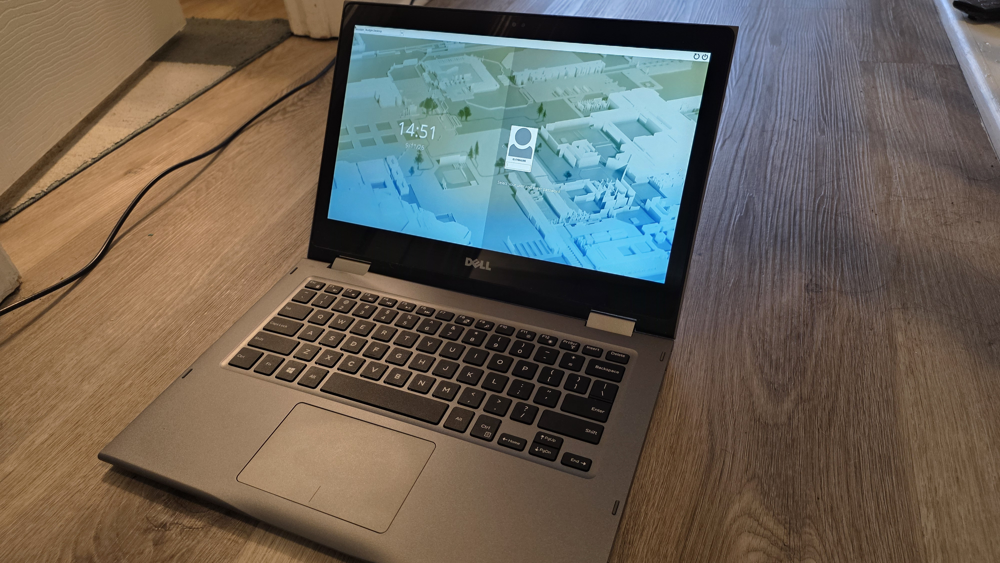

# Laptop Hardware Repair and Linux Deployment

## Project Overview

Diagnosed and repaired a personal Dell laptop with an intermittently
failing integrated keyboard, then performed additional hardware
maintenance, updated the system firmware, and completed a clean Fedora
Linux deployment.

The repair required complete system disassembly because the keyboard
was integrated into the palmrest assembly rather than being
independently serviceable.

This project included fault isolation, replacement-part research,
hardware disassembly and reassembly, cooling-system maintenance,
firmware updating, storage preparation, operating-system installation,
and post-repair verification.

## Initial Problem and Diagnosis

Several keys on the laptop's integrated keyboard either failed
completely or operated intermittently.

I tested the system with an external keyboard, which operated normally.
This helped isolate the problem to the laptop's integrated keyboard
rather than a general input or operating-system problem.

I researched the laptop model and found reports of similar keyboard
failures, then investigated replacement options.

Because I wanted to verify the exact replacement part rather than rely
only on model-level compatibility information, I partially disassembled
the laptop to expose the original assembly's part-number label before
ordering the replacement.

## Hardware Repair

Replacing the keyboard required extensive disassembly because it was
integrated into the palmrest assembly.

The repair involved:

- Disassembling the laptop to access the keyboard/palmrest assembly
- Verifying the original component part number
- Replacing the keyboard/palmrest assembly
- Replacing the main battery
- Replacing the RTC/CMOS battery
- Removing and reinstalling the cooling assembly
- Reassembling the laptop and verifying operation

The repair ultimately required removing nearly all internal components
from the chassis to reach and replace the integrated keyboard assembly.

Components and fasteners were organized during the teardown to support
accurate reassembly.

## Cooling-System Maintenance

Because the cooling assembly had to be removed during the repair, I
also cleaned the cooling system and replaced the existing thermal
compound.

After removing the cooling assembly, the processor surfaces were
cleaned in preparation for new thermal compound.

The original thermal compound had hardened significantly. I removed
the old material and applied fresh thermal compound before reinstalling
the cooling assembly.

This allowed necessary maintenance to be completed while the system was
already disassembled rather than requiring another teardown later.

## Reassembly and Hardware Verification

After completing the keyboard replacement and cooling-system
maintenance, I reinstalled the motherboard, internal cabling, speakers,
cooling assembly, batteries, and other components.

After reassembly, I verified that the system successfully powered on
and completed POST and confirmed that the hardware was detected
correctly.

I also updated the system BIOS before proceeding with the operating
system deployment.

## Fedora Linux Deployment

After the hardware repair and firmware update, I repurposed the laptop
as a Fedora Linux system.

Fedora was installed as a clean deployment on an SSD that previously
contained Windows. I removed the previous Windows installation,
reconfigured the drive partitions, formatted the Linux filesystem as
ext4, and completed the Fedora installation.

The completed system was returned to normal operation with the repaired
keyboard and new Linux installation.

## Troubleshooting Approach

The repair followed a structured troubleshooting process:

1. Identify and reproduce the keyboard symptoms.
2. Test an external keyboard to isolate the problem.
3. Research the laptop model and known keyboard failures.
4. Verify the exact replacement component before ordering.
5. Perform the required hardware disassembly and replacement.
6. Complete cooling-system maintenance while the system was
   disassembled.
7. Reassemble the laptop and verify POST and hardware detection.
8. Update system firmware.
9. Perform a clean operating-system deployment.
10. Verify normal operation after the repair.

## Skills Demonstrated

- Laptop hardware troubleshooting
- Peripheral fault isolation
- Replacement-part research and verification
- Complete laptop disassembly and reassembly
- Keyboard and palmrest replacement
- Main and RTC/CMOS battery replacement
- Cooling-system maintenance
- Thermal compound replacement
- BIOS/firmware updates
- POST and hardware verification
- SSD preparation and partitioning
- Linux filesystem configuration
- Fedora Linux installation
- Operating-system deployment
- Technical research and problem solving

## Project Context

This was a personal technical project rather than professional work.

It is included in this portfolio because the project demonstrates
hands-on endpoint hardware troubleshooting, component replacement,
firmware maintenance, operating-system deployment, and verification
skills directly applicable to computer support.
