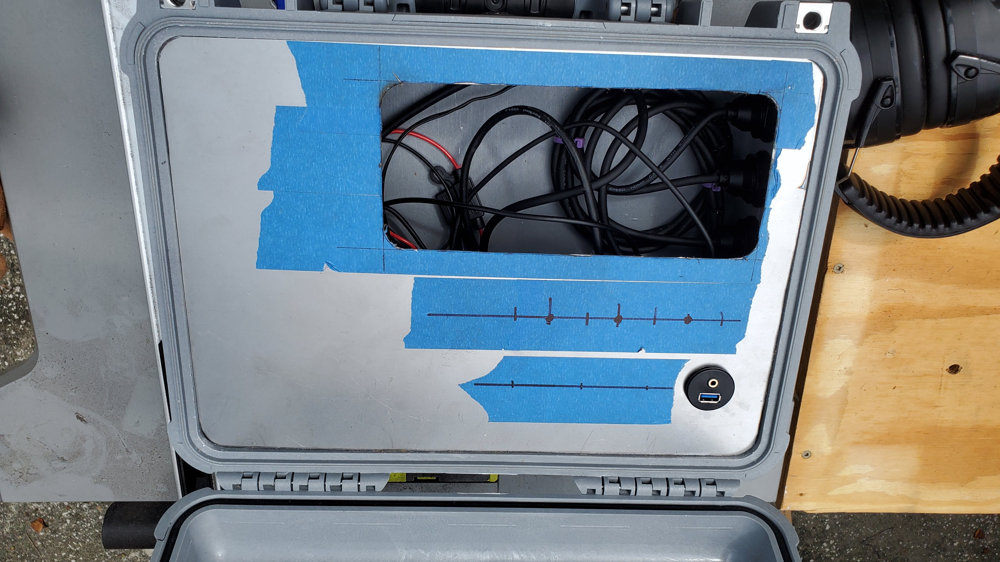
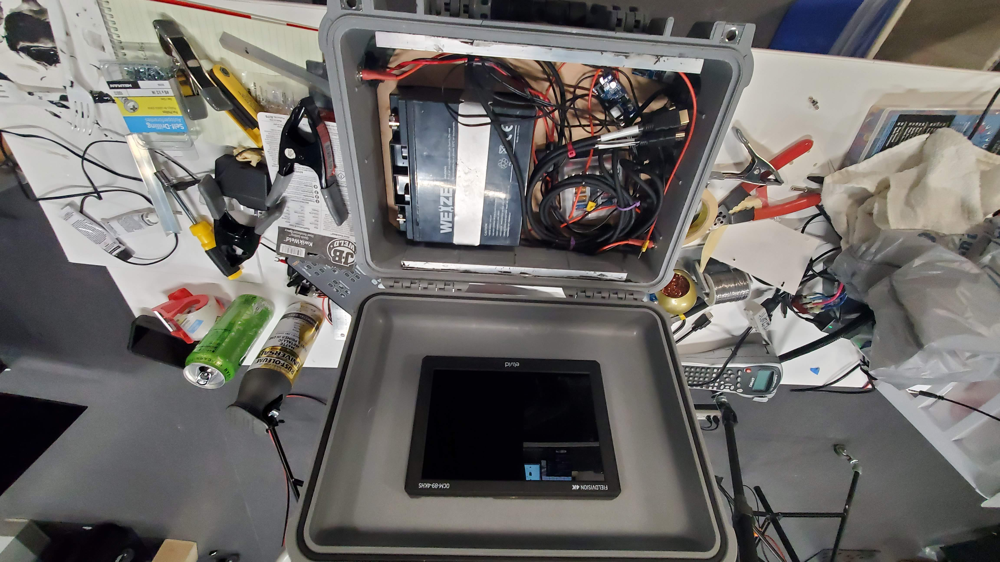
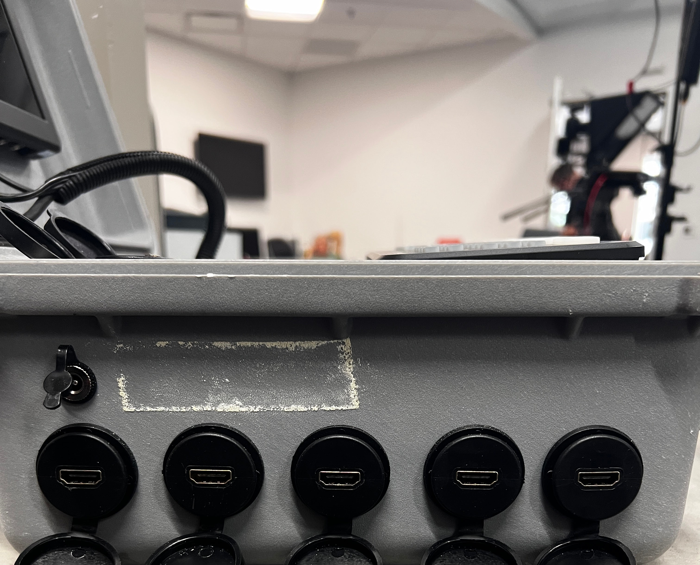
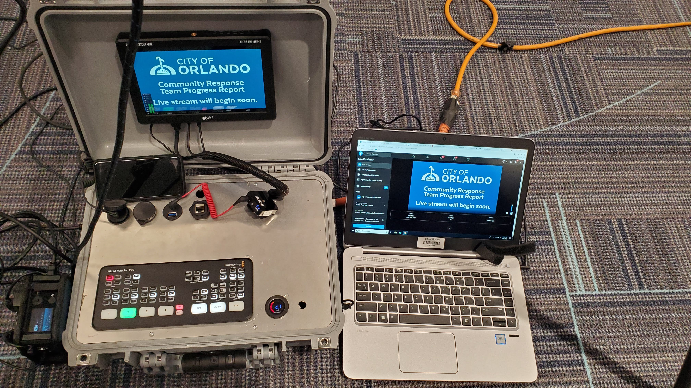

# Self-Contained Mobile Streaming System

## Project Overview

Designed and built a portable, self-powered live-production and
streaming system to provide additional production capability and
redundancy for important field livestreams.

The system was developed after the primary LiveU transmission workflow
failed during several important livestreams, including emergency-event
coverage. Those experiences demonstrated the need for an alternate
streaming path that could be deployed quickly if the primary system
encountered a problem.

The completed system integrated an ATEM Mini Pro, multiview monitoring,
onboard battery power, external connectivity, and multiple possible
streaming workflows into a portable field package.

## My Role

I designed and built the system as part of my professional work.

My responsibilities included developing the redundant streaming
workflow, selecting and integrating equipment, designing and wiring the
12-volt power system, installing individual circuit protection,
providing external power and signal connections, configuring the ATEM
Mini Pro, testing alternate streaming paths, and supporting the system
during field deployment.

## Production Capabilities

Before this system was developed, a typical field livestream could use
a single camera connected directly to the LiveU transmission system.

Adding the ATEM Mini Pro provided a small multicamera production
environment rather than limiting the stream to a single camera.

The system supported:

- Multiple camera inputs
- Live camera switching
- Program output
- Multiview monitoring
- Title and holding screens
- Direct streaming through the ATEM Mini Pro
- Computer-based streaming through OBS when needed
- Integration with the existing LiveU workflow

Title and holding screens also improved the presentation of field
streams by allowing a stream to begin with intentional graphics rather
than immediately showing a live camera pointed into the room before an
event started.

## Streaming Redundancy

Reliability was one of the primary design goals.

The existing LiveU system remained an important transmission option,
but the portable system provided additional ways to get a livestream
online if the normal workflow encountered a problem.

Depending on the connectivity available at a location, the system could
support several workflows:

### LiveU Workflow

The production output could be used with the existing LiveU
cellular-bonded transmission system.

### Direct ATEM Streaming

When Ethernet Internet access was available, the ATEM Mini Pro could
operate as the streaming encoder and provide an alternate path that did
not depend on the LiveU for encoding.

An Ethernet passthrough connection on the case provided network access
to the ATEM without requiring networking equipment to be installed
inside the system.

### Laptop and OBS Workflow

If Ethernet was unavailable but Wi-Fi Internet access was available,
the ATEM could be connected to a laptop and used with OBS.

This provided another streaming workflow using the laptop's available
network connection.

Internet connectivity itself could come from the venue, a hotspot, or
the LiveU bonded Internet connection depending on the circumstances.

The goal was not to depend on a single transmission method when
covering important events.

## Power System

The system included its own 12-volt sealed gel battery so that the
production equipment could operate without depending entirely on venue
power.

I designed and wired the DC power distribution inside the system.

Equipment that could accept the battery voltage directly was powered
from the battery within its supported input range. Devices requiring a
different voltage were supplied through appropriate DC step-down
converters.

Each powered circuit was individually fused through a fuse distribution
bar.

The system also included a USB charging port for auxiliary devices and
could provide power to the LiveU unit when required.

This made the case both a production system and a portable power source
for the equipment used in the streaming workflow.

## Monitoring and Connectivity

A dedicated display provided the ATEM Mini Pro multiview output,
allowing multiple camera sources and production status to be monitored
from the portable system.

External connections were designed to make field deployment simple,
including an Ethernet passthrough connection to the ATEM.

The case itself did not contain a router or network switch. Internet
connectivity was supplied by the available venue network, a hotspot, or
the LiveU bonded connection depending on the deployment.

## Design Approach

The system was designed around three goals:

1. Provide a backup streaming workflow when the primary transmission
   method was unavailable.
2. Expand field production from a single-camera workflow to multicamera
   production with switching, monitoring, and graphics.
3. Reduce dependence on external infrastructure by incorporating
   onboard power and flexible connectivity.

The system was tested with the alternate workflows before being relied
upon for field production.

## Skills Demonstrated

- Technical systems design and integration
- Redundant workflow and failover planning
- Live-streaming systems
- ATEM Mini Pro configuration and operation
- OBS-based streaming
- Ethernet and Wi-Fi connectivity
- Cellular-bonded transmission workflows
- Multicamera video production
- Multiview monitoring
- Hardware integration
- 12-volt DC power distribution
- DC voltage conversion
- Individually fused equipment circuits
- Portable battery-powered system design
- External I/O and connectivity
- Technical troubleshooting
- Field deployment and operational support

## Physical System

The system was designed and fabricated as a custom portable platform
rather than assembled from an off-the-shelf streaming package.

### Construction

The enclosure was modified to accommodate the system controls,
connections, monitoring, and internal components.

### Internal Power and Electronics

The internal build incorporated the battery-powered electrical system,
power distribution, voltage conversion, wiring, and integrated
monitoring.

### External Connectivity

External connections were integrated into the enclosure so equipment
could be connected during field deployment without requiring access to
the internal wiring.

### Field Deployment

The completed system provided switching, monitoring, graphics, and
alternate streaming workflows as a portable field-production platform.

## Project Context

This system was designed and built as part of my professional municipal
broadcast and media-production work.

It was created in response to reliability problems encountered during
real livestreaming operations and provided additional production and
transmission options for important field events.
