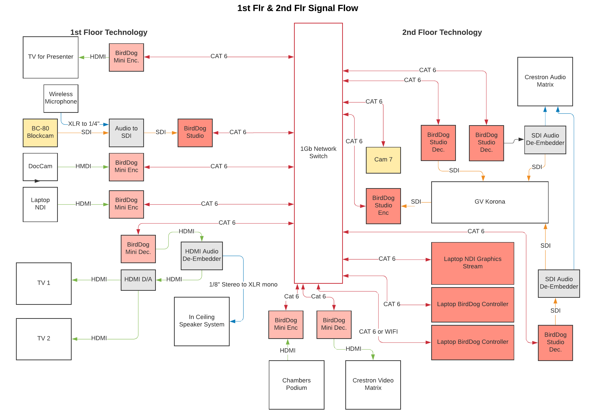

# Networked AV / NDI Production System

## Project Overview

Supported and documented a multi-room professional video production
environment that used NDI to transport video across the network while
also integrating traditional SDI, HDMI, and audio signal paths.

The system connected production equipment across two floors and included
cameras, presentation sources, NDI encoders and decoders, production
switching, AV control systems, and audio embedding and de-embedding.

## My Role

As part of my professional responsibilities, I supported the operation
and troubleshooting of this environment and created signal-flow
documentation showing how the major components were interconnected.

The documentation provided a visual reference for tracing video,
network, and audio paths through a system that combined IP-based video
transport with traditional broadcast and AV infrastructure.

My work with the environment included supporting NDI devices and
production equipment, working with device connectivity and network
configuration, tracing signal paths, troubleshooting communication and
video-routing problems, and maintaining documentation used to understand
the system.

## System Technologies

The environment incorporated:

- NDI video transport
- BirdDog NDI encoders and decoders
- Gigabit Ethernet connectivity
- SDI and HDMI video
- Audio embedding and de-embedding
- Production video switching
- Cameras and presentation sources
- AV control systems
- Computer-based production sources

## Original System Documentation

The following signal-flow diagram was created as part of my professional
work to document the production environment.

The diagram shows the relationship between network-connected NDI
devices and the traditional video and audio infrastructure used by the
production system.

## Troubleshooting Approach

Supporting the environment required understanding the complete signal
path rather than treating individual devices in isolation.

When a source was unavailable or a signal did not reach its expected
destination, troubleshooting involved determining where in the path the
failure occurred and whether the problem involved the source device,
physical connection, NDI transport, conversion hardware, production
equipment, or destination.

Maintaining an accurate signal-flow diagram made that process more
efficient by providing a reference for the expected relationships
between devices and signal paths.

## Skills Demonstrated

- Technical troubleshooting
- Networked AV and NDI
- TCP/IP-connected production devices
- Signal-flow analysis
- SDI and HDMI infrastructure
- Audio and video systems
- Hardware connectivity
- Systems documentation
- Production technology support
- Complex system troubleshooting

## Project Context

This diagram represents a professional production environment that is
no longer in service. It is included as an example of technical
documentation I created and the systems I supported during my
professional career.
