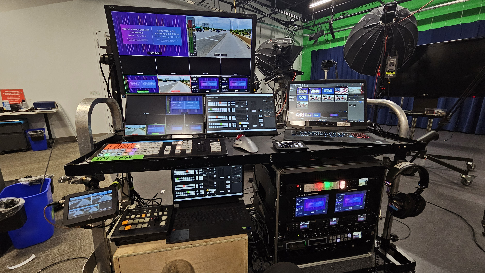

# Portable Field Production System

## Project Overview

Designed and built an integrated portable production system for
professional field video production.

The system combined production switching, recording, playback,
streaming, camera control, monitoring, computer-based production tools,
signal I/O, audio monitoring, and rack-mounted equipment into a single
deployable platform.

A significant part of the system was IP-based. Multiple production
devices communicated over a local Ethernet network that I designed and
configured, while a travel router provided flexible Internet
connectivity for streaming operations.

The goal was to create a portable system that could be transported to a
venue, connected to the available network infrastructure, and operated
as a reliable self-contained production environment.

## My Role

I designed and built the system as part of my professional work.

My responsibilities included planning how the components would work
together, selecting and integrating equipment, determining signal
paths, installing hardware, designing and configuring the production
network, configuring Internet connectivity and streaming redundancy,
creating production-control macros, maintaining device firmware,
testing the completed system, and supporting it during field use.

The project required integrating traditional audio/video systems,
computers, peripherals, networked devices, Internet services, and
production-control automation into a single operational environment.

## System Integration

The portable system incorporated:

- Video production switching
- Recording and playback systems
- Two streaming encoders
- Multiview and production monitoring
- Computer-based production and control tools
- Video signal input and output
- Audio monitoring
- Network-controlled cameras
- Camera controller
- Production laptop
- Travel router and Ethernet switching
- Rack-mounted production equipment
- Physical equipment integration and cable management

## Networked Production Environment

A significant part of the system integration involved designing and
configuring the network used by the IP-connected production equipment.

The production network included:

- Production switcher
- Recorder
- Playback system
- Production laptop
- Two streaming encoders
- Camera controller
- Three network-connected cameras
- Travel router providing network and Internet connectivity
- Unmanaged Ethernet switch connecting the production devices

I configured the network addressing for the production equipment and
reserved IP addresses for the devices through the router so that each
device had a predictable address on the network.

I also configured known static addressing on the equipment for use when
needed. This provided a predictable addressing plan that did not depend
on discovering or reassigning device addresses during field deployment.

### IP Addressing Design

I designed a simple addressing scheme that grouped production devices
by function, making device addresses predictable and easier to identify
during setup and troubleshooting.

| Function | Address Range |
| --- | --- |
| Router / Gateway | 192.168.1.1 |
| Core production equipment | 192.168.1.10–13 |
| Streaming encoders | 192.168.1.20–21 |
| Camera control system | 192.168.1.30–33 |

The core production group included the switcher, recorder, playback
system, and production laptop. The camera-control group included the
controller and three network-connected cameras.

This organization made it easier to identify a device's expected
address and isolate connectivity problems during setup and field
deployment.

## Internet Connectivity and Streaming Redundancy

The system was designed to accommodate different Internet connectivity
available at field locations.

When a venue provided wired Ethernet, I connected the venue network to
the travel router for Internet access. When wired connectivity was not
available, the travel router could instead connect to an available
wireless network while the internal production network remained
connected behind it.

The two streaming encoders were configured with primary and fallback
streaming capability. I configured YouTube fallback streams so that a
second encoder could continue the stream if the primary encoder
encountered a problem.

When venue Internet connectivity was unreliable, I could also place one
encoder on a separate hotspot connection. This provided an independent
Internet path rather than having both streaming encoders depend on the
same venue connection.

This approach provided redundancy at both the streaming-device and,
when necessary, Internet-connectivity level.

## Device Configuration and Maintenance

I was responsible for configuring and maintaining the production
devices used in the system, including keeping device firmware current.

Much of the troubleshooting occurred during the design, integration,
and testing phase. Connectivity, device configuration, signal-flow, and
interoperability problems were identified and resolved before the
system entered regular field use.

As a result, the completed system was stable during normal deployment
and required relatively little troubleshooting in production.

## Production Control and XML Macros

The production workflow also required custom control macros.

I created and modified macros in XML format to automate production
functions and create repeatable control sequences for the system.

This required working directly with structured configuration data,
understanding how individual commands affected the production
equipment, testing the resulting behavior, and refining the macros
until the automated sequences operated as intended.

## Troubleshooting Approach

Building and testing the system required troubleshooting across several
technical layers:

- Physical cabling and connectivity
- Device configuration
- IP addressing and network communication
- Internet connectivity
- Streaming configuration
- Computer and peripheral operation
- Firmware and device interoperability
- Audio/video signal flow
- Production-control configuration

Troubleshooting required determining which layer of the complete
workflow was responsible for a problem rather than treating each device
independently.

The emphasis during development was to identify and resolve these
problems before field deployment so that the finished system would
operate reliably during live production.

## Physical System

The following photograph shows the completed portable production system
used for field deployment.

## Skills Demonstrated

- TCP/IP networking
- IP address planning and configuration
- DHCP reservations and static IP configuration
- Ethernet device connectivity
- Wired and wireless Internet connectivity
- Network troubleshooting
- Streaming redundancy and failover planning
- Network-controlled camera systems
- Streaming encoder integration
- Device configuration and firmware maintenance
- XML configuration and production-control macros
- Systems integration
- Hardware installation
- Technical troubleshooting
- Video signal-flow analysis
- Computer and peripheral integration
- Rack equipment integration
- Field deployment
- System testing and operational support

## Project Context

This system was designed, built, configured, tested, and supported as
part of my professional municipal broadcast and media-production work.
